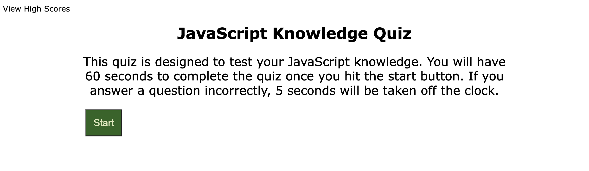
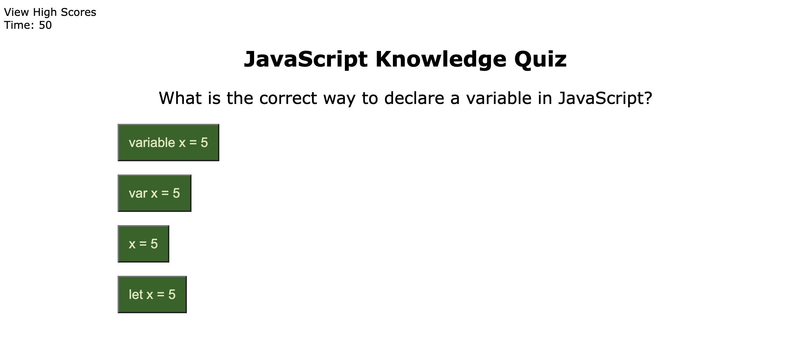

# JavaScript Timed Quiz

## Description
This is a timed quiz to test your JavaScript knowledge. This application consists of ten questions about JavaScript, and allows the user 60 seconds to answer every question.

## Usage
To begin the quiz, click the Start button. You have 60 seconds to answer all questions correctly; if you answer a question incorrectly 5 seconds is removed from the clock. Once you've finished the quiz, you will have the opportunity to enter your initials and save your highscores for later. 

Here's a link to the deployed website: https://williamk31.github.io/04-Challenge_Quiz/

See screenshots for reference:

### Contributors
Made by William Kalish